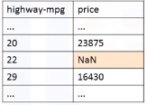

# Week 2: Data Wrangling
## Video 2.1: Pre-processing Data in Python
### Data pre-processing
* the process of converting or mapping data from initial "raw" form into another format, in order to prepare the data for further analysis
* Often known as data cleaning, data wrangling
### Learning Objectives:
* Identify and handle missing values
* Data formatting: pandas
* Data normalization (centering/scaling)
* Data Binning
* Turning Categorical values to numernic variables
### Simple Dataframe Operations
```py
import pandas as pd

# access column
df["column-name"]

# assign to variable
column1 = df["column-name"]

# manipulate values of whole column (ex: +1 all values)
df["column-name"] = df["column-name"]+1
```
## Video 2.2: Dealing with Missing Values in Python
### Missing Values
* What is a missing value?
* Missing values occue when no data value is stored for a variable (feature) in an observation
* Could be represented as:
    * "?"
    * "N/A"
    * 0
    * a blank cell
    * NaN
### How to deal with missing data?
* Check with the data collection source
* check if you can retrieve the missing values
* maybe just remove the data where the missing value is found
    * drop the variable entirely
    * drop the individual entry
* replace the missing values
    * replace it with an average (of similar datapoints)
    * replace it by frequency
    * replace it based on other funtions (if the data scientist knows something additional about the missing data)
* Leave it as missing data
### Dealing with missing categorical data
* Replace with mode (the value that appears most often in column)
### How to drop missing values in Python (pandas)
* Use df.dropna()  

```py
# drop the entire row
df.dropna(axis=0)

# drop the entire column
df.dropna(axis=1)

# drop the NaN in price
df.dropna(subset=["price"], axis=0, inplace=True)

#or

df = df.dropna(subset=["price"], axis=0)
```
### How to replace missing values in Python
* use df.replace(missing_value, new_value)  

```py
#set a mean
mean = df["normalized-losses"].mean()

#replace
df["normalized-losses"].replace(np.nan, mean)
```
## Video 2.3: Data Formatting in Python
### Data Formatting
* Data are usually collected from different places and sorted in different formats
* Bringing data into a common standard of expression allows users to make meaningful comparison  

### Applying calculations to an entire column
* Convert "mpg" to "L/100km" in Car dataset
```py
# convert entire column (ex: mpg to L/100km)
df["city-mpg"]= 235/df["city-mpg"]

#rename
df.rename(columns=("city-mpg", "city-L/100km"), inplace=True)
```

### Incorrect Data Types
* Sometimes the wrong data type is assigned to a feature
```py
# To identify data types
df.dtypes()

# to convert data types
df.astype()

df["price"] = df["price"].astype("int")
```
## Video 2.4: Data Normalization in Python
### Data Normaliztion
* Uniform the features value with different range
* normalization makes the range of the values consistens, which may make statistical analyses easier down the road  

### Methods of normalizing data

### Simple feature scaling in Python

```py
# divide max value
df["length"] = df["length"]/df["length"].max()
```
### Min-max in Python

```py
df["length"] = (df["length"]-df["length"].min())/(df["length"].max()-df["length"].min())
```
### Z-score

```py
df["length"] = (df["length"]-df["length"].mean())/df["length"].std()
```
## Video 2.5: Binning in Python
* Binning: grouping of values into "bins"
* Converts numeric into categorical variables
* Group a set of numerical values into a set of "bins"
* ex: "price" is in a feature range from 5000 ti 45500, he wants to have a better representation of price  

### Binning in Python

```py
binwidth = int((max(df["price"])-min(df["price"]))/4)

bins = range(min(df["price"]), max(df["price"]), binwidth)

group_names = ['Low','Med','High']

df['price']= pd.cut(df['price'], bins, labels=group_names)
```
### Visualizing binned data

## Video 2.6: Turning Categorical Variables into quantitative variables in Python
### Categorical Variables
* Problem:
* Most Statistical models cannot take in the objects/strings as input
* "One-hot encoding"  

### Dummy variables in Python pandas
* Use pandas.get_dummies() method
* Convert categorical variables to dummy variables (0 or 1)
```py
pd.get_dummies(df['fuel'])

```