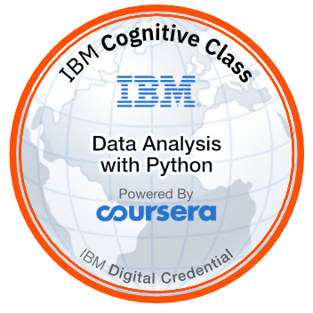

# Data Analysis with Python - Notes

## Overview
* Author: Patrick Dolloso
* Date obtained: Nov 26 2018
* Link: [Data Analysis with Python](https://www.coursera.org/account/accomplishments/certificate/EXYYYMTG8D4F)
* This repository contains notes and projects during my completion of the IBM certification in R 101
### Directory
1. [Week 1: Importing Databases](./1-Importing_DBs/readme.md)
2. [Week 2: Data Wrangling](./2-Data-Wrangling/readme.md)
3. [Week 3: Exploratory Data Analysis](./3-Exploratory-Data-Analysis/readme.md)
4. [Week 4: Model Development](./4-Model-Development/readme.md)
5. [Week 5: Model Evaluation](./5-Model-Evaluation/readme.md)
6. [Projects](./Projects/readme.md)